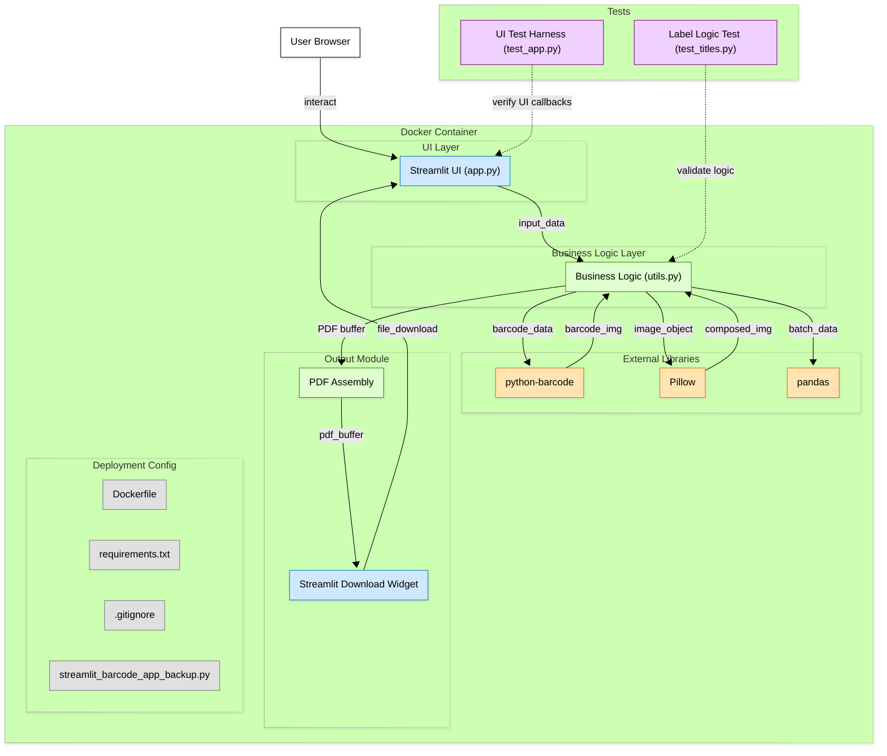

# Office Barcode Generator

**This application is developed exclusively for office/workplace operations and productivity purposes.**

A professional Streamlit web application for generating bulk barcodes optimized for office environments and business workflows.

## Important Notice

**This application is specifically designed for professional office use and operational efficiency. It is not intended for academic, educational, or data science portfolio purposes.**

## Office Features

- **Professional Barcode Generation**: Code128 format for office inventory
- **Custom Labeling**: Add titles for office asset identification
- **Print-Ready Output**: A4 format at 300 DPI for office printers
- **Workplace Efficiency**: Streamlined interface for office staff

## Quick Start

### Prerequisites
- Python 3.7 or higher

### Installation
1. Navigate to the project directory
2. Install dependencies:
```bash
pip install -r requirements.txt
```

### Run Application
```bash
streamlit run app.py
```

## Office Usage

### Web Interface
1. **Add Office Items**: Enter item numbers and quantities
2. **Label Items**: Add descriptive titles for office assets
3. **Generate Labels**: Create professional barcode sheets
4. **Print**: Download PDF for office printer

## Technical Specifications

- **Format**: PDF at 300 DPI for office printing
- **Barcode Standard**: Code128 (industry standard)
- **Paper Size**: A4 (office standard)
- **Layout**: Auto-optimized for office printers

## Dependencies

- `streamlit`: Web interface
- `python-barcode`: Barcode generation
- `Pillow`: Image processing
- `pandas`: Data management

## Project Structure

```
Barcode Gen/
├── app.py                       # Main Streamlit application
├── utils.py                     # Core barcode generation utilities
├── test_app.py                  # Test functionality
├── requirements.txt             # Dependencies
├── README.md                    # Documentation
└── test_titles.py               # Title feature tests
```

## System Architecture

The following diagram illustrates the application's system architecture and component relationships:



## Office Use Cases

**Designed specifically for office and business operations:**

- **Office Inventory Management**: Generate barcodes for internal supply tracking
- **Workplace Asset Labeling**: Create labels for office equipment and furniture
- **Internal Operations**: Barcode workflows for office processes
- **Business Document Tracking**: File identification systems for office use
- **Professional Labeling**: Office product identification

*This tool is built for practical workplace applications and operational efficiency.*

## Office Printing Guidelines

1. **Paper**: Use standard A4 office paper
2. **Quality**: Set office printer to high quality mode
3. **Test Print**: Always test with office printer first
4. **Scanner Test**: Verify barcodes work with office scanners

---

**Made with love for efficient office barcode generation and workplace productivity**

*This application is specifically designed for professional office use and operational efficiency. It is not intended for academic, educational, or data science portfolio purposes.*
